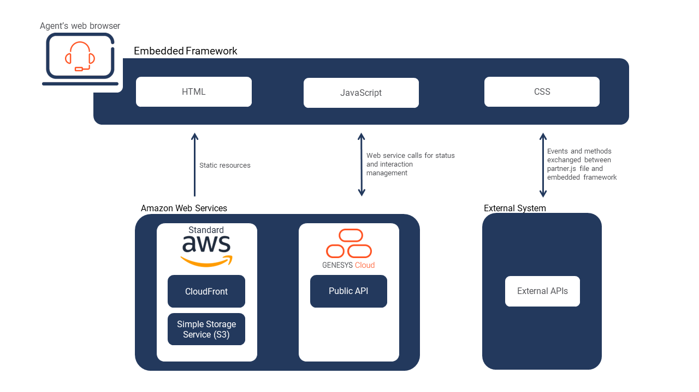

# Build a CRM application that uses Geensys Cloud embeddable framework

> View the full [Build a CRM application that uses Geensys Cloud embeddable framework Blueprint](https://developer.mypurecloud.com/blueprints/embeddable-framework-blueprint/ "Goes to the embeddable-framework-blueprint repo") in the Genesys Cloud Developer Center.

This Genesys Cloud Developer Blueprint provides instructions for building a CRM application that uses the Genesys Cloud embeddable framework. This sample contains dynamic setting of the framework.js configuration items.

